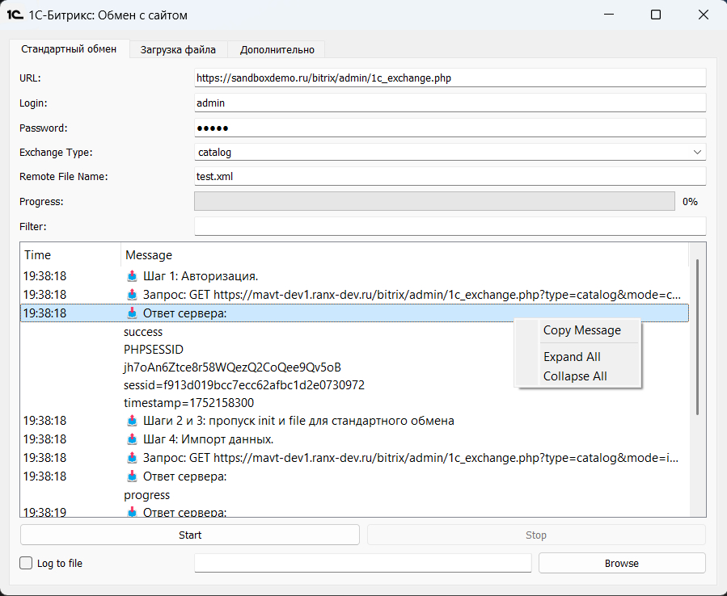

# Bitrix Exchange GUI



A cross-platform PyQt5 desktop application for managing data exchange with 1C-Bitrix websites.  
Supports file upload (XML/ZIP), catalog synchronization, progress tracking, and logging. Designed for developers or administrators working with 1C and Bitrix integrations.

## Features

- Supports standard exchange mode and direct file upload
- Real-time progress bar with server response logs
- Console output with structured log tree and filtering
- Optional log-to-file functionality
- GUI built with PyQt5 and QtWidgets
- Graceful interruption and error handling

## Screenshots

[Add screenshots of the main window here if available.]

## Requirements

- Python 3.7+
- PyQt5
- requests

## Installation

```bash
git clone https://github.com/your-username/bitrix-exchange-gui.git
cd bitrix-exchange-gui
pip install -r requirements.txt
```

## Running the Application

```python
python main.py
```

## Directory Structure

```
bitrix-exchange-gui/
├── dist                
|  └── main.exe         # Builded application for Win11
├── resources           # Resources for building an application                
├── main.py             # Main GUI application
├── exchange_worker.py  # Worker thread for HTTP exchange
├── requirements.txt
└── README.md
```

## Typical Use Cases

- Upload catalogs or price lists from 1C to Bitrix
- Test Bitrix exchange endpoints without using 1C
- Analyze and debug exchange responses via GUI logs
